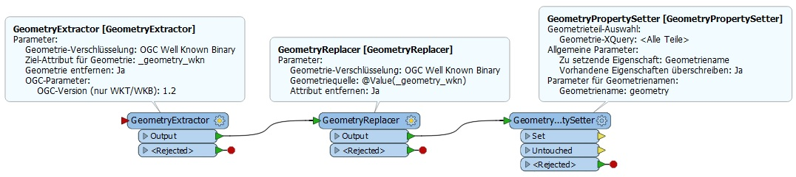
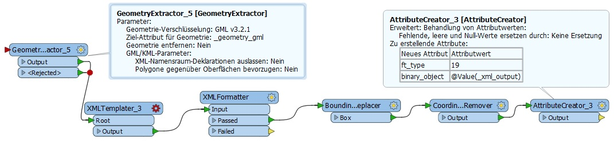

#

INSPIRE Umsetzung mit FME - Workflow
====================================

## Inhalt
* [Einleitung](#einleitung)
* [FME-Workflow](#fme-workflow)
* [Summary](#summary)

## Einleitung
Ich möchte hier kurz den recht praktischen und einfachen Workflow für die Transformation von Geodaten in das INSPIRE-Zielschema vorstellen. Dabei handelt es sich um komplexe, xml-basierte und objektorientierte Schemata, mit der alle GIS-Clients ihre arge Not haben. Man könnte sagen, da wurde etwas an den Nutzern vorbei entwickelt. Es gibt mittlerweile zwar mit GeoJSON und GeoPackage zwei additional Encodings, diese sind aber nicht INSPIRE-konform und wie der Name schon sagt, nur ein zusätzliches Format, das es dem Nutzer einfacher machen soll.

Die Zieldaten werden in einer PostgreSQL/PostGIS Datenbank (deegree SQLFeatureStore im BLOB-Modus) gespeichert. Das ist die Rahmenbedingung, die überhaupt erst diesen Workflow ermöglicht. Denn in diesem FeatureStore wird ein gml-Objekt einfach in einem BLOB-Attribut gespeichert.
Das [Konfigurationsfile](config/Soil.xml) für den deegree SQLFeatureStore kann mit dem deegree-cli-utility Client generiert werden. Genauso das [sql-File](config/Soil.sql) zum Anlegen der Datenbanktabellen.

Für die Transformation kommen verschiedene Applikationen zum Einsatz, von denen alle ihre Stärken und Schwächen haben. Wo das eine Werkzeug Schwächen hat, da verwende ich das andere Werkzeug. Zum Einsatz kommen FME, Eclipse XML Editors and Tools, Altova XMLSpy sowie das ETF Testing framework for spatial data and services. Mit den XML Editors and Tools behalte ich den Überblick, generiere Beispiel xml-Files aus den xsd-Schemata. Dabei muss nur beachtet werden, dass bei choice Elementen immer nur das erste generiert wird. XMLSpy dient einer grundlegenden und der ETF-Validator einer detaillierten Validierung. Der XML-Validator von FME dagegen taugt nichts. Eine abschließende Validierung erfolgt letztendlich dann noch über den deegree WFS, bei einem Request über den gesamten Datenbestand. Die Validierung spielt hier eine so große Rolle, weil ich bei diesem Lösungsansatz ganz allein dafür verantwortlich bin, dass die gml-Objekte valide sind. 

## FME-Workflow
Die eigentliche Transformation erfolgt mit FME, der Feature Manipulation Engine von safe. Ich werde nachfolgend nur auf die Besonderheiten eingehen, die für die Generierung eines INSPIRE-konformen GML‘s benötigt werden. Es sei ausdrücklich darauf hingewiesen, dass nicht das INSPIRE Solution Pack für FME zum Einsatz kommt, sondern FME pure ohne Erweiterungen.

### Feature-Geometrie
Als erstes kümmern wir uns um die Geometrie und schreiben mit dem INSPIRE GML-Writer ein gml-File. Dazu vereinfachen wir die Geometrie, indem wir diese mit einem GeometryExtractor als OGC Well Known Binary extrahieren. So wird z.B. aus einem Multiploygon, mit nur einem Polygon, ein Singlepolygon (vgl. Abb. 1). Damit der Writer die Geometrie auch ins GML einbaut, müssen wir mit dem GeometryPropertySetter die Geometrie dem Writer-Attribut zuweisen. Das war es schon. Es gibt natürlich auch den umgekehrten Fall, dass Singlepolygone vorliegen, vom Zielschema aber Multipolygone gefordert werden. Dazu bauen wir vor dem GeometryPropertySetter noch einen Aggregator auf das Attribut gml_id ein. Das fertige gml-File wird validiert und solange berichtigt, bis es korrekt ist. Dieses gml-File ist die Vorlage für den XML-Templater.

Abb. 1: Geometrie Bearbeitung

### GML-Objekte
Im finalen Transformationsmodell wollen wir kein gml-File schreiben, sondern gml-Objekte erzeugen und diese in ein BLOB-Attribut unserer Datenbanktabelle einfügen. Dazu müssen wir zunächst die Geometrie mit einem GeometryExtractor als GML 3.2.1 extrahieren (vgl. Abb. 2). Und können nun alle Attribut-Values über xQuery Funktionen (get-attribute , get-xml-attribute, get-xml-list-attribute) in unser xml-Template einbauen. Mit dem XMLFormatter formatieren wir das Ganze dann in ein linearisiertes gml-Objekt (vgl. Abb. 2).

Abb. 2: gml-Objekte für BLOB-Attribut

Es folgen ein paar Nacharbeiten. Die eigentliche Geometrie wird im GML-Objekt gespeichert. Zusätzlich benötigt deegree aber auch den Extent im Datenbankattribut gml_bounded_by und zwar für die räumliche Suche und Indexierung. Dazu wird mit dem BoundingBoxReplacer die Geometrie durch ihre Bounding Box ersetzt (vgl. Abb. 2) und im PostGIS-Writer gml_bounded_by als räumliches Attribut festgelegt. Wichtig ist noch, dass wir das Koordinatensystem löschen (CoordinateSystemRemover). Ansonsten bekommt deegree Probleme (doppeltes Koordinatensystem). Im AttributeCreator ist anschließend der Fremdschlüssel für die betroffene Objektart anzugeben. Die Objektarten sind in der Datenbanktabelle feature_types definiert. 

## Summary
Damit habe ich einen praktischen und einfachen FME-Workflow für die INSPIRE-Transformation vorgestellt. FME ist sehr leistungsfähig und robust. Diese Vorteile werden mit diesem Lösungsweg ausgeschöpft. Zudem läuft die Transformation in einer geschlossenen Softwarelösung. Die Entwicklung erfolgt mit FME-Desktop und die automatisierte Transformation auf einem FME-Server.

Der vorgestellte Workflow ist in den obigen [FME Custom Transformern](README.md#fme-custom-transformer) gekapselt. Ich selbst benutze diese aber nie und habe sie nur zur Nachnutzung erstellt.
